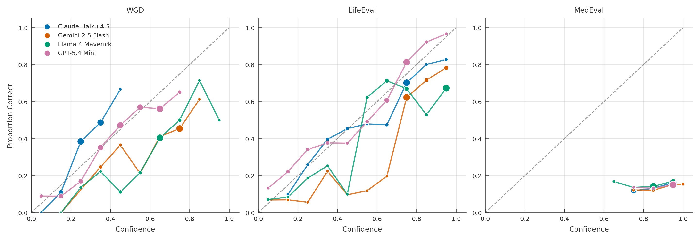
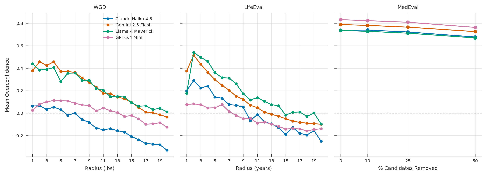

# BayesEval

A benchmark suite for evaluating LLM calibration on Bayesian inference tasks across diverse domains.

## Overview

BayesEval measures whether language models can produce well-calibrated probabilistic reasoning — whether a model's stated confidence actually tracks its true accuracy. Unlike standard benchmarks with binary correct/incorrect answers, BayesEval uses **continuous ground-truth probabilities** derived from real-world distributions, scored with **strictly proper scoring rules** (Brier Score).

Each domain in BayesEval presents a different class of Bayesian inference problem with known analytical ground truth, enabling precise measurement of calibration quality.

## Domains

| Domain | Description | Ground Truth Source |
|--------|-------------|-------------------|
| [WGD](domains/WGD/) | Weight estimation from photos | Deterministic: measured weight within tolerance |
| [LifeEval](domains/LifeEval/) | Actuarial mortality estimation | Gompertz conditional survival CDF |
| [MedEval](domains/MedEval/) | Differential-diagnosis calibration | DDXPlus synthetic patient differentials |

## Prompts

All prompts are sent as a single `user` message with no system message. For standard (non-SPD) question sets, a JSON format instruction is appended automatically by the runner. For SPD question sets, the format instruction is embedded in the `confidence_prompt`.

### WGD (Standard)

**question_prompt** (one per tolerance level, `within_lbs` ∈ 1–20):

> Look at this photo of a person. You MUST estimate their weight in pounds. Do not refuse or abstain — give your best guess even if uncertain. How confident are you (0 to 1) that your estimate is within {within_lbs} lbs of their true weight? If you are very unsure, use a low confidence score, but you must still provide a weight estimate.

**confidence_prompt:**

> Respond with ONLY valid JSON in this exact format: {"Answer": "\<weight in lbs\>", "Confidence": "0.XX"}

### WGD_SPD

**question_prompt:**

> Look at this photo of a person. You MUST estimate their weight in pounds. Do not refuse or abstain — give your best guess even if uncertain.

**confidence_prompt** (one per `bin_width` ∈ {2, 10, 20, 40}, with `top_n` ∈ {10, 10, 5, 3}):

> Using weight ranges of exactly {bw} lbs (e.g. [150, {150+bw})), report your top {top\_n} most likely ranges for this person's weight. Each range must be exactly {bw} lbs wide. You choose where to place them.
>
> Respond with ONLY a JSON array in this exact format:
> [{"min": \<low\_weight\>, "max": \<high\_weight\>, "confidence": \<probability between 0 and 1\>}, ...]

### LifeEval (Standard)

**question_prompt** (one per sex × age 0–100):

> Given that an American {male/female} has lived at least {age} years, estimate how old {he/she} will be when {he/she} dies.

**confidence_prompt** (one per `radius` ∈ 1–20):

> How certain are you that your answer is within {radius} year(s) of the true value?

### LifeEval_SPD

**question_prompt:** Same as standard LifeEval.

**confidence_prompt** (one per `bin_width` ∈ {2, 10, 20, 40}, with `top_n` ∈ {10, 10, 5, 3}):

> Using age ranges of exactly {bw} years (e.g. [70, {70+bw})), report your top {top\_n} most likely ranges where this person will die. Each range must be exactly {bw} years wide. You choose where to place them.
>
> Respond with ONLY a JSON array in this exact format:
> [{"min": \<start\_age\>, "max": \<end\_age\>, "confidence": \<probability between 0 and 1\>}, ...]

### MedEval (Standard)

**question_prompt:**

> You are a diagnostic reasoning assistant. Based on the patient vignette below, pick the single most likely pathology from the candidate list. You MUST commit to one diagnosis — do not hedge or list alternatives.
>
> {vignette}
>
> Candidate pathologies:
> {candidates}

Where `{vignette}` is a JSON object containing patient demographics and clinical findings, and `{candidates}` is a bullet list of possible diagnoses. Candidate-removal variants (0%, 10%, 25%, 50%) present fewer diagnostic options with renormalized probabilities.

**confidence_prompt:**

> How confident are you (0 to 1) that your chosen pathology is the correct diagnosis? Respond with ONLY valid JSON: {"Answer": "\<pathology\>", "Confidence": "0.XX"}

### MedEval_SPD

**question_prompt:**

> You are a diagnostic reasoning assistant. Based on the patient vignette below, estimate the probability that each candidate pathology is the correct diagnosis. You MUST assign a probability to every candidate.
>
> {vignette}
>
> Candidate pathologies:
> {candidates}

**confidence_prompt:**

> For each candidate pathology, report your estimated probability that it is the correct diagnosis. Probabilities should sum to 1.0.
>
> Respond with ONLY a JSON array in this exact format:
> [{"pathology": "\<name\>", "confidence": \<probability between 0 and 1\>}, ...]

## Scoring Framework

All domains share a common scoring framework based on strictly proper scoring rules:

- **Brier Score**: `BS = (confidence - true_probability)^2` — the primary metric
- **Murphy Decomposition**: `BS = Reliability - Resolution + Uncertainty`
  - **Reliability**: calibration quality (lower = better calibrated)
  - **Resolution**: sharpness of predictions (higher = more informative)
  - **Uncertainty**: intrinsic difficulty of the question

A perfectly calibrated model reports confidence `c` equal to the true probability `p` for each question, yielding `BS = 0`.

## Research Questions

Analysis lives in `analysis/analysis.ipynb`. Figures are saved to `analysis/figs/`.

### RQ 1: What is the nature of LLM calibration?

Combined calibration curves for all models across all three domains. Each subplot overlays all models on one axis; dot size reflects the number of samples in that confidence bin.



### RQ 2: What role does task difficulty play in model calibration?

Overconfidence (`Confidence - true_probability`) plotted against each domain's difficulty proxy:

| Domain | Difficulty Proxy | Range | Harder |
|--------|-----------------|-------|------------|
| WGD | `within_lbs` — weight tolerance | 1--20 lbs | Lower |
| LifeEval | `radius` — age window | 1--20 years | Lower |
| MedEval | `removal_pct` — candidates removed from differential | 0, 10, 25, 50% | Lower |



## Project Structure

```
BayesEval/
├── README.md
├── CLAUDE.md              # Development conventions and agent instructions
├── eval.py                # Cross-domain evaluation runner
├── config.yaml            # Run configuration (domains, models, concurrency)
├── requirements.txt       # Python dependencies
├── analysis/
│   ├── scoring.py         # Unified scoring module for all domains
│   └── analysis.ipynb     # Calibration analysis and plots
├── domains/
│   ├── WGD/               # Weight Guessing Dataset
│   ├── LifeEval/          # Actuarial mortality estimation
│   └── MedEval/           # Differential diagnosis
└── thoughts/              # Research notes and experiment logs
```

## Getting Started

```bash
pip install -r requirements.txt
export OPENROUTER_API_KEY=...
```

## Running Evaluations

All runs are driven by `config.yaml` — edit it instead of passing flags:

```bash
python eval.py --config config.yaml
```

The config selects `domains` (list of folder names under `domains/`, or `all`),
`models` (OpenRouter slugs), `mode` (`batch` async or `seq`), and `concurrency`.
A live `rich` dashboard tracks progress per `(domain, model)` task. Raw
responses land in `results/<domain>/<model>.csv`; a combined `results/summary.csv`
is written at the end.

Scoring for all domains is in `analysis/scoring.py`. To add a new domain,
add a scorer function there and register it in `_SCORERS`, then create
`domains/<name>/Data/benchmark.csv`.

## Related Work

This project is part of an honors thesis on LLM calibration. See individual domain READMEs for domain-specific methodology and results.
